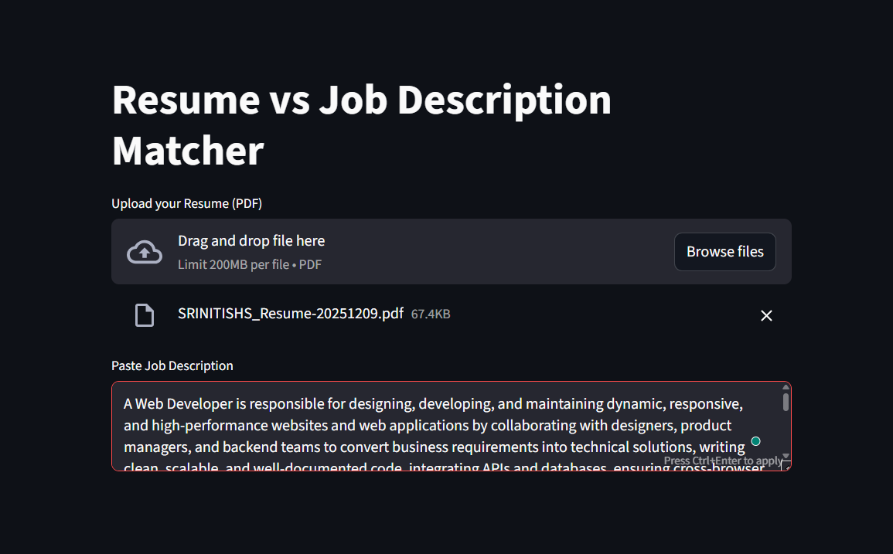
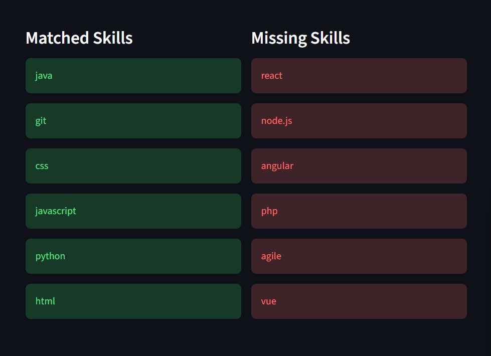

# 📄 Resume–Job Description Skill Gap Analyzer  
### AI-Powered Resume Matching & Skill Gap Analysis System

<p align="center">
  
  
  
  
</p>

---

## Project Overview

The **Resume–Job Description Skill Gap Analyzer** is an intelligent recruitment-support application that evaluates how well a candidate’s resume matches a given job description. The system automatically extracts relevant skills from both the resume and the job description, computes a **resume–JD compatibility score**, and performs a **skill gap analysis** by identifying matched and missing skills.

This project closely replicates the internal logic of **modern Applicant Tracking Systems (ATS)** used in real-world hiring pipelines and demonstrates the practical application of **Natural Language Processing (NLP)** and **machine learning similarity techniques** in HR technology.

---

## Application Preview

<p align="center">
  <em>Resume Upload and Job Description Input</em><br/>
  
</p>

<p align="center">
  <em>Resume–JD Matching Score</em><br/>
  
  
</p>

<p align="center">
  <em>Skill Gap Analysis View</em><br/>
  
</p>

---

## Key Features

- Upload resumes in **PDF format**
- Paste any **job description**
- Automatic **skill extraction using regex-based NLP**
- Resume matching using **TF-IDF Vectorization and Cosine Similarity**
- Clear visualization of **matched skills and missing skills**
- Lightweight, fast, and scalable architecture
- Recruiter-friendly web interface built using **Streamlit**

---

The resume text is extracted using **PyPDF2**. Skills are identified using a predefined skill ontology and regular expressions. Only job-relevant skills are considered. These skills are converted into numerical vectors using **TF-IDF**, and **Cosine Similarity** is applied to calculate the final resume–job match percentage. The system then clearly displays matched and missing skills.

This workflow mirrors the screening logic used by enterprise-level ATS platforms.

---

## 🌍 Real-World Application

Modern recruitment faces a critical challenge: **efficiently matching the right candidates to the right roles**. Job descriptions often contain extensive skill requirements, while resumes differ widely in structure, terminology, and formatting. Manual comparison is not only time-consuming but also prone to inconsistency and unconscious bias.

The **Resume–Job Description Skill Gap Analyzer** addresses this challenge by **automating resume–JD comparison using NLP and machine learning**, delivering faster, fairer, and data-driven hiring insights.

### 🔹 For Job Seekers
- Identify **missing or weak skills** relative to a target job role.
- Obtain a **clear skill match percentage** to improve resume alignment.
- Receive actionable insights on **what skills to learn next** (e.g., AWS, Docker, Machine Learning).
- Make informed career decisions based on role-specific requirements.

### 🔹 For Recruiters & Hiring Teams
- Accelerate candidate screening by **instantly highlighting skill matches and gaps**.
- Reduce manual effort in parsing resumes and job descriptions.
- Ensure **fairness and consistency** in applicant evaluation.
- Improve shortlisting accuracy during high-volume hiring.

### 🔹 For Career Coaches & Educational Institutions
- Help students align resumes with **industry expectations**.
- Provide **measurable feedback** on skill readiness for specific roles.
- Identify training gaps and design targeted upskilling programs.
- Support placement cells with automated resume screening tools.

### 🔹 Enterprise-Level Relevance
This system mirrors the core logic of **Applicant Tracking Systems (ATS)** used by enterprises and recruitment platforms. It can be integrated into real-time hiring pipelines as a **resume pre-screening microservice**, improving efficiency and decision quality at scale.

---

## Technologies and Libraries Used

**Programming Language**
- Python 3.9+

**Libraries and Frameworks**
- PyPDF2 – PDF text extraction  
- scikit-learn – TF-IDF Vectorizer and Cosine Similarity  
- re – Regular expression-based skill extraction  
- Streamlit – Web-based user interface  

---


---

## How to Run the Project

Install the required dependencies:
```bash
pip install -r requirements.txt
streamlit run app.py


## System Workflow (Real-Time Pipeline)

