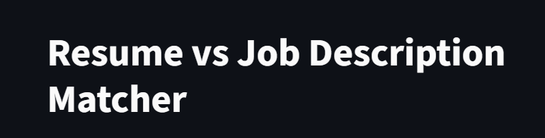
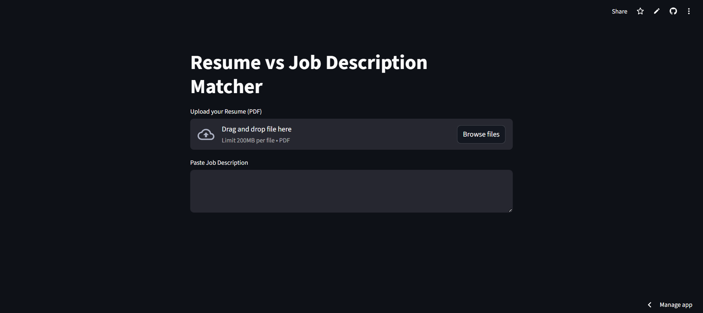
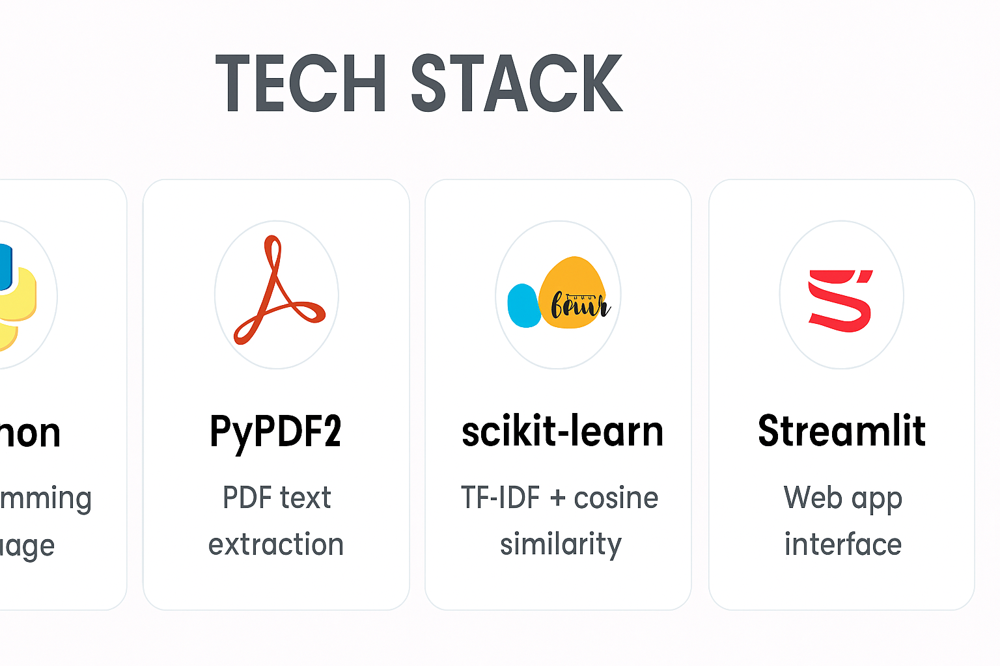
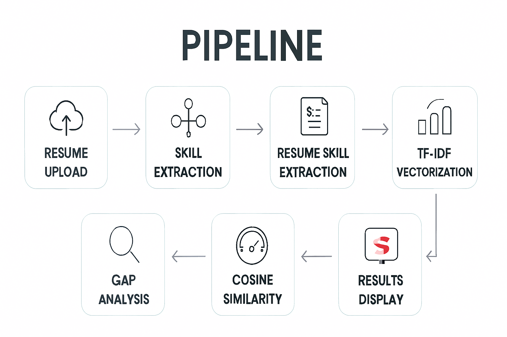
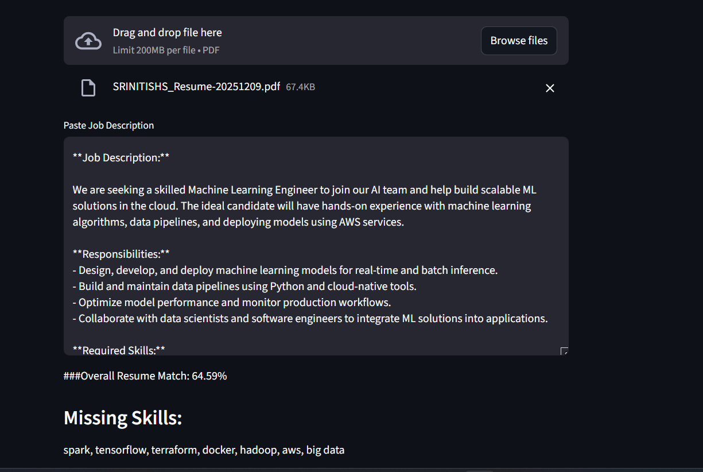

# 📊 Job-Skill-Gap-Analyzer



## 🔎 Overview
Job-Skill-Gap-Analyzer is a lightweight NLP-based application that compares a resume against a job description to measure skill similarity and highlight missing skills. It uses **PyPDF2** for PDF text extraction and **scikit-learn (TF‑IDF + cosine similarity)** for calculating match scores. Designed for job seekers and recruiters, it provides quick insights into candidate fit.

---
## 🌍 Real-World Use Case

Recruitment today faces a major challenge: **matching the right candidates to the right jobs quickly and accurately**. Job descriptions often list dozens of required skills, while resumes vary in format and wording. Manually comparing them is time-consuming and prone to bias.

**Job-Skill-Gap-Analyzer** solves this problem by automating the comparison process:

- **For Job Seekers:**  
  - Identify missing skills in their resume relative to a target job description.  
  - Get a clear skill similarity score to tailor resumes more effectively.  
  - Receive actionable insights into what to learn next (e.g., AWS, Docker, Machine Learning).  

- **For Recruiters:**  
  - Speed up candidate screening by highlighting skill matches and gaps.  
  - Reduce manual effort in parsing resumes and job descriptions.  
  - Improve fairness and consistency in evaluating applicants.  

- **For Career Coaches & Educators:**  
  - Help students align their resumes with industry expectations.  
  - Provide measurable feedback on skill readiness for specific roles.  

### 📌 Example Scenario
A company is hiring a **Machine Learning Engineer** with AWS expertise.  
- The job description requires skills like *Python, Machine Learning, AWS, Docker*.  
- A candidate’s resume shows *Python, SQL, Pandas, Machine Learning*.  
- The analyzer outputs:  
  - **Skill Similarity:** 70%  
  - **Matched Skills:** Python, Machine Learning  
  - **Missing Skills:** AWS, Docker  

This gives the candidate a clear roadmap to improve their profile and helps the recruiter quickly assess fit.

## ✨ Features
- 📂 Upload resume (PDF) and extract text  
- 📝 Paste job description text  
- ⚡ Calculate skill similarity using TF‑IDF + cosine similarity  
- 🛠️ Identify missing skills from a curated skill list  
- 🌐 Streamlit interface for easy use  



---

## 🧰 Tech Stack
- Python  
- PyPDF2 → PDF text extraction  
- scikit-learn → TF‑IDF + cosine similarity  
- Streamlit → Web app interface  



---

## 🚀 Pipeline



1. **Resume Upload** → Extract text from PDF using PyPDF2  
2. **Job Description Input** → Paste JD text into the app  
3. **Skill Extraction** → Match JD text against a curated skills list  
4. **Resume Skill Extraction** → Check which JD skills appear in the resume  
5. **TF‑IDF Vectorization** → Convert JD skills and resume skills into vectors  
6. **Cosine Similarity** → Compute skill similarity percentage  
7. **Gap Analysis** → Identify missing skills  
8. **Results Display** → Show similarity score, matched skills, missing skills  

---

## 📊 Example Output



- **Skill Similarity:** 64.59%  
- **Missing Skills:** spark, tensorflow, terraform, docker, hadoop, aws, big data  

---

## ▶️ Usage
```bash
git clone https://github.com/srinitish/Job-Skill-Gap-Analyzer.git
cd Job-Skill-Gap-Analyzer
pip install -r requirements.txt
streamlit run app.py
